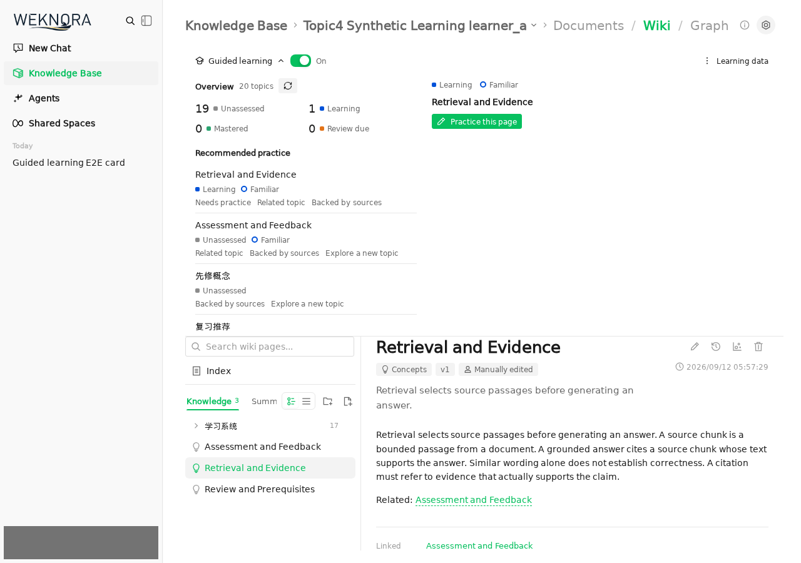
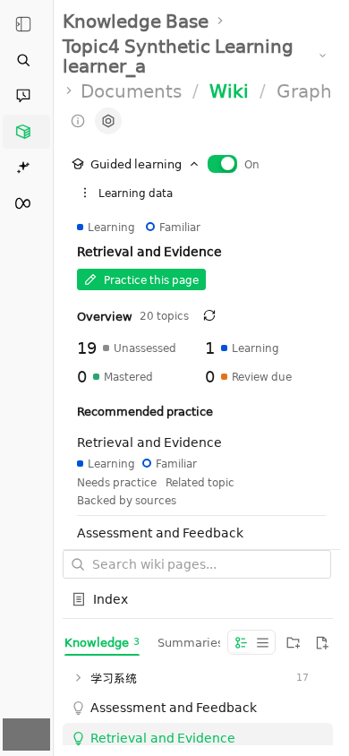
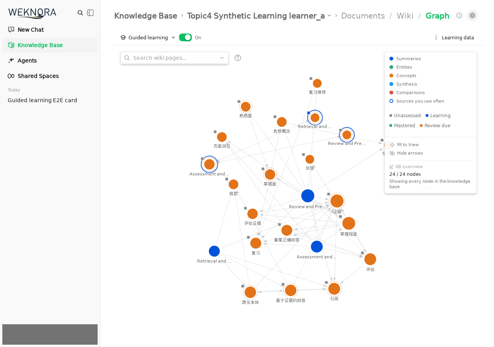
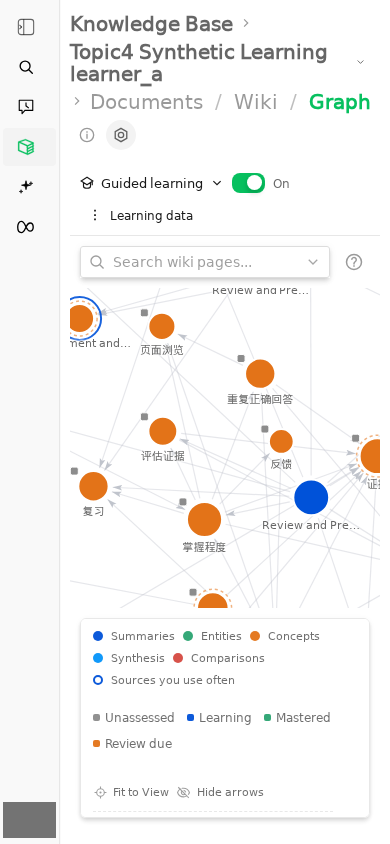
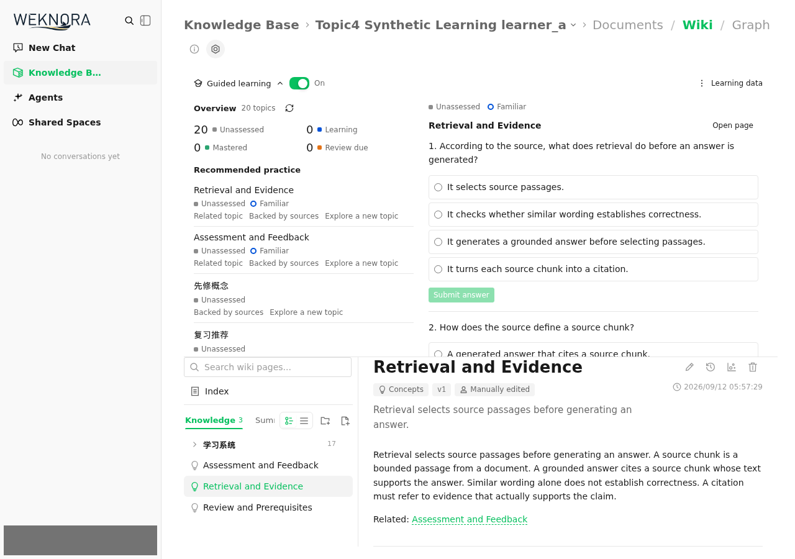
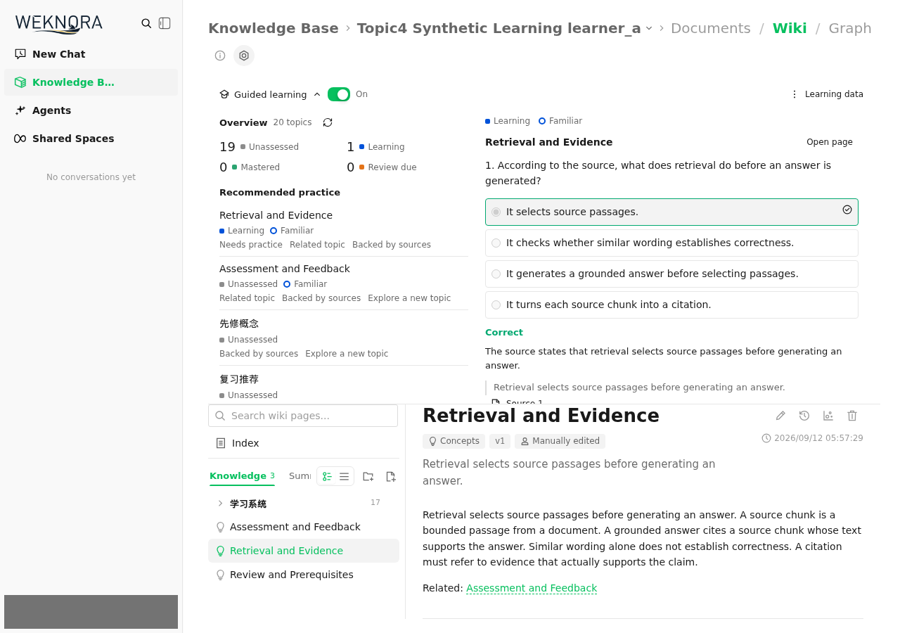
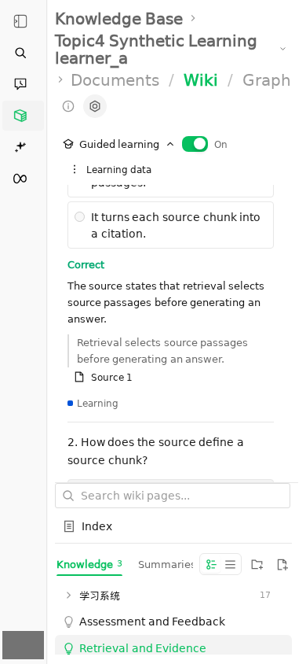
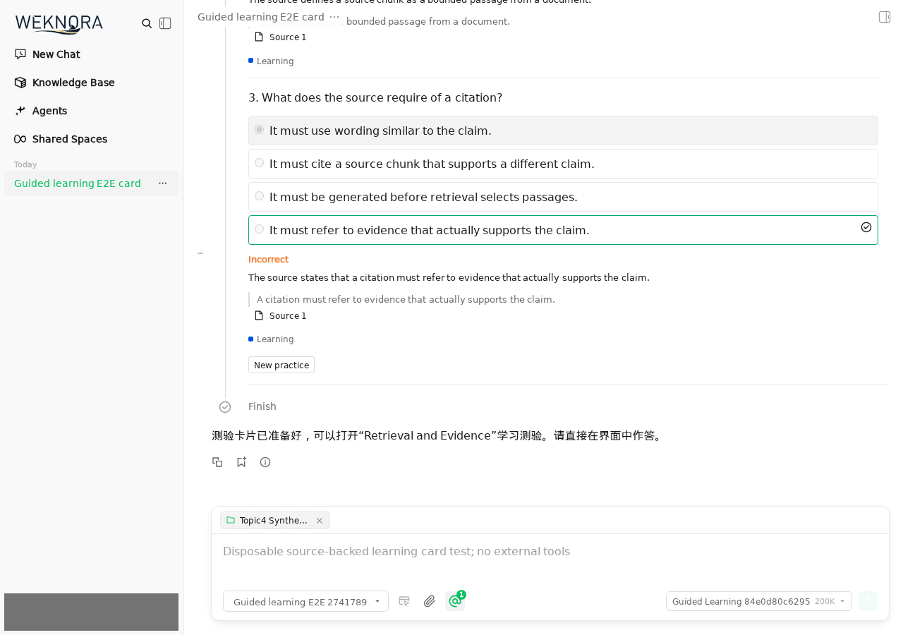
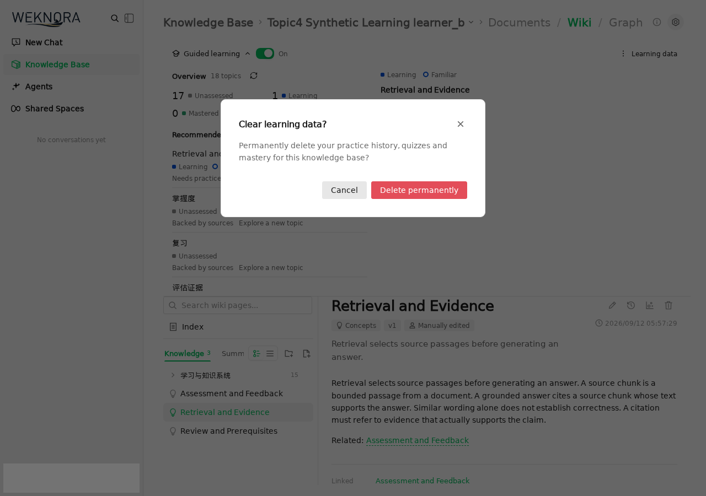
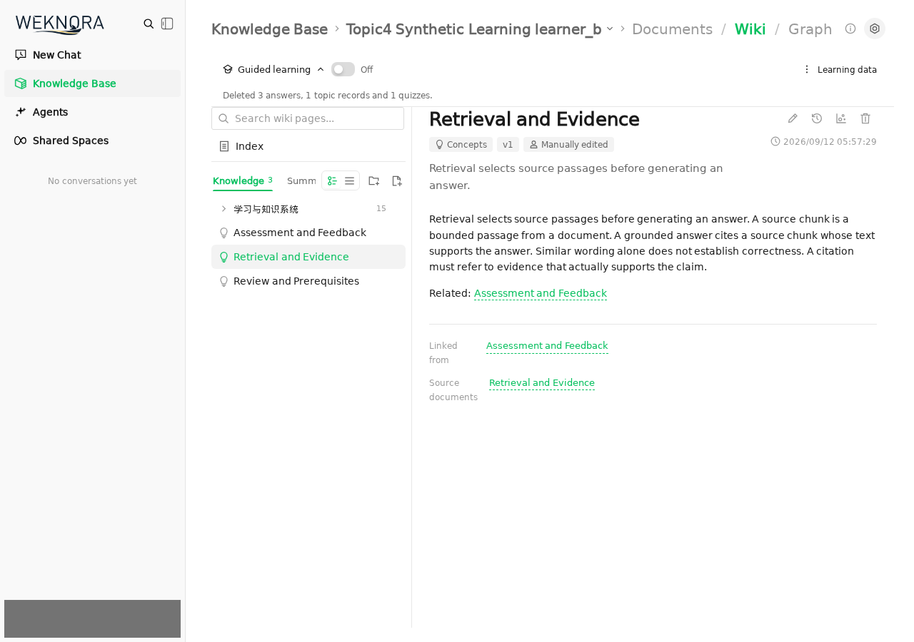

# 功能截图

截图来自真实运行的合成测试知识库，身份区域已遮盖。题目由配置模型生成，答案通过 UI 提交并由服务端判分。

## Wiki 学习

推荐显示理由，阅读状态和掌握度分开呈现。

## 知识网络

图中圆形节点颜色表示 Wiki 类型，方形标记表示学习状态，圆环表示熟悉度。

## 测验与反馈

未作答时只显示题目和选项；提交后显示判分、解释与来源引文。

## Agent 与隐私

