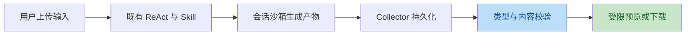
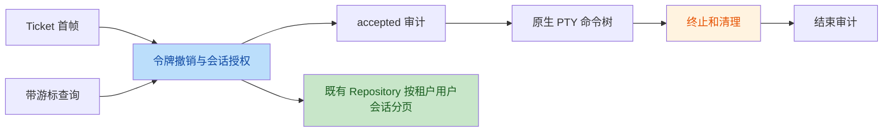

# 课题二任务与架构复核

代码 `28d676539ca25fcff06aa18aa315eff14c092e43`；Tag `rhino-2026-final-2-v3`；官方 main `462999ec3f5c1467ef0ccf5cf8c422393f40a0e6`。本次审查修复五项真实缺陷，旧 v1/v2 Tag 保留。不能据此无条件宣称题目所有口径已经验收：当前资源监督覆盖单条命令及后代，最新版完整浏览器验证未完成，邮件尚未发送。

## 代码问题与修复

审查覆盖 PR 相对官方 main 的改动、调用上下文、现有仓储和认证约定。五项候选均经两名独立复核者确认，结论一致；未把普通聊天允许脚本的兼容设计或上游已有实现列为本次缺陷。

| 编号 | 严重度 | 旧版本问题 | 当前修复 | 代码 |
| --- | --- | --- | --- | --- |
| F4 | P1 | 登录撤销未传递到 Ticket 和活动控制台 | 绑定签发令牌 ID，复用访问令牌校验；消费时检查过期，周期和逐命令检查撤销，保留正常轮换 | [workbench_ticket.go:148](https://github.com/mingri31164/WeKnora/blob/28d676539ca25fcff06aa18aa315eff14c092e43/internal/application/service/workbench_ticket.go#L148) |
| F2 | P2 | XLSX 改名 XLS 绕过 Office 解压预算 | ZIP 表格内容统一预校验后才进入 SheetJS；覆盖五种扩展名、总展开量和外部关系 | [WorkbenchDocumentPreview.vue:123](https://github.com/mingri31164/WeKnora/blob/28d676539ca25fcff06aa18aa315eff14c092e43/frontend/src/components/WorkbenchDocumentPreview.vue#L123) |
| F3 | P2 | Mermaid 纯文本降级后被下游重新启用 | 固定传 txt；组件回归验证最终类型保持 text | [WorkbenchDocumentPreview.vue:144](https://github.com/mingri31164/WeKnora/blob/28d676539ca25fcff06aa18aa315eff14c092e43/frontend/src/components/WorkbenchDocumentPreview.vue#L144) |
| F1 | P2 | 审计仅显示最新 100 条，早期命令不可查询 | 复用 AuditLogQuery.AfterID 和 next_cursor；120 条真实仓储分页、权限过滤及前端竞态回归 | [workbench_audit.go:163](https://github.com/mingri31164/WeKnora/blob/28d676539ca25fcff06aa18aa315eff14c092e43/internal/application/service/workbench_audit.go#L163) |
| F5 | P2 | 累计输出超限原因被 closed/unknown 覆盖 | 独立保留 output_limit；清理成功记失败，清理未确认仍记 unknown | [workbench_socket.go:467](https://github.com/mingri31164/WeKnora/blob/28d676539ca25fcff06aa18aa315eff14c092e43/internal/handler/workbench_socket.go#L467) |

F1 的旧实现请求 after_id=100 仍返回最新 ID120，而非 ID99。F4/F5 使用真实 SQLite 和 WebSocket、PTY 替身复现，不冒充真实后端攻击测试。F2 的探针用 14,002 字节 ZIP 和 8,389,082 字节工作表复现。F3 捕获了 Mermaid 设置外部 Image.src 的尝试，网络在测试中被拦截，实际外网请求为零。修复后的回归及完整测试以 validation-report.md 为准。

## 任务逐项判断

| 任务 | 判断 | 实现和边界 |
| --- | --- | --- |
| 统一终端会话接口 | 当前主线范围内实现，存在题目版本差异 | CommandTerminal 屏蔽 Docker TTY 和远端 envd。官方当前技能/沙箱文档已移除 local；本 PR 未恢复宿主执行。原生 Cube 未实测 |
| 交互式终端 | 已实现 | 原生 PTY、输入、实时输出、中断和尺寸调整；每条命令独立，不保留跨命令 cd/export 状态。上游可重连 Shell 单独保留 |
| 文件管理 | Docker/E2B 兼容环境完成 | 浏览、上传下载、新建目录、重命名、删除；根为 /workspace/output。Cube 文件能力关闭，不宣称全后端文件管理 |
| 三类产物预览 | 已实现，最新版浏览器证据不足 | PPTX 页浏览、受限 HTML iframe、表格视图；本轮补 Office 改名和 Mermaid 降级回归。历史截图不可替代最新版浏览器实测 |
| 演示文稿 Skill 完整链路 | 已实现，运行证据按版本分开 | 独立 presentation-builder 复用已有 Skill 安装、read_file/shell_exec、Collector 和下载；两轮 Agent 原产物均保留，最后一轮生成早于本轮修复 |

## 验收逐项判断

| 验收 | 当前结论 | 验证范围 |
| --- | --- | --- |
| 终端至少两种后端可用 | 通过已部署两后端验收 | Docker Engine 与 Kubernetes E2B 兼容后端；不等于 E2B Cloud、原生 Cube 或 MicroVM 验证 |
| 两租户同时只见自身进程和文件 | 通过本机部署验收 | 双终端同时 READY、进程标记/PID namespace、文件可见性、跨租户拒绝和审计核对 |
| 产物根目录外路径服务端拒绝 | 通过文件 API 验收 | 绝对路径、..、symlink、特殊节点及 inode 竞态。该限制不约束 root shell 在自身沙箱中的文件访问 |
| 三类产物直接查看且网页隔离 | 实现和历史 UI 证据具备；最新版全 UI 未验收 | opaque iframe、禁脚本/禁网 CSP、Office 预校验；本轮组件回归不能替代真实浏览器 |
| CPU/内存/时长超限终止，每条命令可查 | 命令级通过；整沙箱会话总量未验收 | CPU60s、采样RSS512MiB与每进程地址空间、命令120s、控制台30min。每次命令预算重置，未汇总 Agent、其他Shell或全部沙箱进程。审计支持保存期内游标查询，命令正文脱敏 |

“会话超限”若指整个沙箱生命周期的累计 CPU、全部进程总内存及销毁，当前实现不能认定满足。部署的容器资源配额与命令级采样监督是不同层次；不能通过换用“会话”措辞把它们视为相同验收。

## 架构与风格

主体分层合理，未发现本轮范围内另建 Agent 引擎或破坏主干职责的行为。Handler 处理 HTTP/WS 与连接生命周期，WorkbenchService 负责授权、预算和审计，Repository 使用既有 GORM 查询，Sandbox 层负责后端协议、租约和命令树清理。授权读取不含凭据、不在 Service 写 SQL；令牌检查复用 UserService，审计分页复用原 AuditLogRepository，无新增表。

Handler 使用消费端窄接口，构造器由 dig 接收具体 Service；该方式与当前沙箱模块一致，没有为满足“所有接口必须搬到同一目录”的字面描述做无关重构。保留 RemoteTerminalSession.Close 的 detach 语义，CommandTerminal.Close 清理命令；两条路由不混用。

Go 遵循仓库 gofmt、Conventional Commits 和差异级 golangci-lint；前端沿用 Vue3、TDesign、现有 API 封装与请求代次约束。测试覆盖规模随认证和解析边界的风险增加。材料与运行日志不进入功能 PR；/docs/dev 仍只在本机忽略。

业务链路：

终端与审计链路：

## 提交收尾

必需材料包括仓库、最终 annotated Tag、完整 SHA、README、运行/测试命令与 submission.yaml。YAML 在独立材料分支根目录；该分支包含最终代码，再提交元数据，不移动任何旧 Tag。源码 ZIP 为补充，公开仓库链接才是代码提交入口。

最终正文应发至 wxg_prc_cpg@tencent.com，标题为【犀牛鸟实战提交】【2】【刘德宝 / mingri31164】。邮件草稿含正确字段及附件；打包检查验证源码 ZIP、patch、清单与 MIME 附件一致性。准备草稿不代表已发送；没有读取或取得已发送邮件凭据。

截止为北京时间 2026-09-13 00:00。发送、保留已发送邮件以及跟进参赛群/邮箱尚未完成；PR 合并和需要维护者批准的云端工作流也不能由本地通过结果替代。最新远端状态见 pr-publication-status.json。

## 文档依据

- 官方 Agent 引擎：website-docs/03-features/07-agent.md。
- 图片与文件访问：website-docs/03-features/21-file-access.md，强调消息与调用者权限。
- 会话与对话体验：website-docs/03-features/18-chat-experience.md。
- Claw Skill：website-docs/05-clients/07-claw-skill.md，描述外部 OpenClaw 接入，不等同于内部演示文稿 Skill。
- Agent 文档链接的技能目录与沙箱：website-docs/03-features/22-skills-sandbox.md，明确 local 已移除。
- Go 后端设计和开发规范：website-docs/02-architecture/02-backend-design.md、website-docs/06-development/01-dev-guide.md 及 README Contributing。
